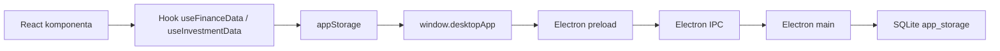
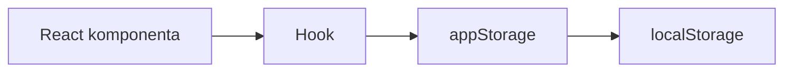

# Architektura aplikace FIGR

## Shrnutí
Tento dokument popisuje architekturu aplikace, použité technologie, rozdělení na frontend a desktop/backend část a způsob komunikace mezi vrstvami.

## Pro koho je dokument určen
- Pro vývojáře, kteří chtějí rychle pochopit strukturu projektu.
- Pro architekta nebo reviewera.
- Pro správce aplikace.

---

## 1. Architektonický přehled
FIGR je desktop-first aplikace založená na tomto modelu:

- frontend: React + Vite + TypeScript
- desktop shell: Electron
- lokální perzistence: SQLite přes `better-sqlite3`
- fallback mimo desktop: `localStorage`

Nejde o klasickou aplikaci typu:
- frontend + REST backend + serverová databáze

Místo toho je architektura:
- renderer (React)
- Electron main proces
- preload bridge
- lokální SQLite key-value storage

---

## 2. Architektonické vrstvy

### 2.1 Prezentační vrstva
Složka:
- `/src/components`
- `/src/pages`

Odpovědnost:
- vykreslení UI
- sběr vstupů od uživatele
- otevření dialogů a panelů

Hlavní vstup:
- `/src/pages/Index.tsx`

### 2.2 Aplikační logika
Složka:
- `/src/hooks`
- `/src/utils`

Odpovědnost:
- správa stavu
- výpočty financí a investic
- orchestrující logika importů, snapshotů a auditů

Klíčové hooky:
- `/src/hooks/useFinanceData.ts`
- `/src/hooks/useInvestmentData.ts`

### 2.3 Perzistence
Složka:
- `/src/lib`
- `/electron`

Odpovědnost:
- načtení a uložení dat
- bridge mezi frontendem a lokální databází
- zálohy a obnova

Klíčové soubory:
- `/src/lib/appStorage.ts`
- `/electron/main.cjs`
- `/electron/preload.cjs`
- `/electron/db.cjs`

---

## 3. Frontend vs backend

### Frontend
Frontend je čistě klientská React aplikace.

Vstupní body:
- `/src/main.tsx`
- `/src/App.tsx`
- `/src/pages/Index.tsx`

Použité technologie:
- React 18
- React Router (`HashRouter`)
- TanStack Query
- Tailwind CSS
- Radix UI
- Recharts

### Backend
Projekt nemá samostatný HTTP backend server.

Místo toho používá Electron main proces jako lokální backend vrstvu:
- `/electron/main.cjs`

Backend zajišťuje:
- otevření okna
- IPC komunikaci
- SQLite storage
- backup management

---

## 4. Komunikační model

### Renderer → preload → main → SQLite



### Bez desktopu
Když není k dispozici `window.desktopApp`, používá se fallback:



To je implementováno v:
- `/src/lib/appStorage.ts`

---

## 5. Struktura složek

### `/src`
Frontend aplikace.

#### `/src/components`
Hlavní UI prvky:
- dashboard
- formuláře
- přehledy
- dialogy

#### `/src/components/investments`
Samostatný investiční modul:
- portfolio overview
- asset table
- asset detail
- dividends
- prices
- exchange rates
- import history
- broker connectors

#### `/src/components/reports`
Reportní modul:
- `/src/components/reports/AnnualReports.tsx`

#### `/src/hooks`
Doménová business logika:
- finance
- investice

#### `/src/types`
Sdílené typy pro finance a investice.

#### `/src/utils`
Výpočty a import/export transformace.

### `/electron`
Desktop shell a lokální backend.

#### `/electron/main.cjs`
- inicializace aplikace
- registrace IPC handlerů

#### `/electron/preload.cjs`
- bezpečné vystavení API do rendereru

#### `/electron/db.cjs`
- SQLite databáze
- zálohy
- obnova

---

## 6. Lokální databáze

### Použitá technologie
- `better-sqlite3`

Soubor:
- `/electron/db.cjs`

### Datový model
SQLite zde neslouží jako plně relační business schéma. Používá se tabulka:

```sql
CREATE TABLE IF NOT EXISTS app_storage (
  key TEXT PRIMARY KEY,
  value TEXT NOT NULL,
  updated_at TEXT NOT NULL
)
```

To znamená:
- business data jsou serializovaná jako JSON
- aplikace si sama spravuje klíče
- logika výpočtů je ve frontendu

Výhoda:
- jednoduchost
- snadné zálohování
- nulová potřeba externího serveru

---

## 7. Grafy

Použitá knihovna:
- `recharts`

Grafy jsou řešené ve vrstvách:

| Funkce | Soubor |
|---|---|
| Vývoj portfolia | `/src/components/investments/PortfolioOverview.tsx` |
| Rozložení portfolia | `/src/components/investments/AssetTable.tsx` |
| Vývoj ceny aktiva | `/src/components/investments/AssetDetail.tsx` |
| Roční reporty a majetek | `/src/components/reports/AnnualReports.tsx` |
| Finanční grafy | `/src/components/Charts.tsx` |

Data do grafů se připravují v:
- `/src/hooks/useFinanceData.ts`
- `/src/hooks/useInvestmentData.ts`
- `/src/utils/calculations.ts`
- `/src/utils/investmentPortfolio.ts`

---

## 8. Integrace

### Finanční import/export
- `/src/components/CSVImport.tsx`
- `/src/utils/importTemplate.ts`

### Investiční import/export
- `/src/components/investments/InvestmentCSVImport.tsx`
- `/src/utils/investmentImportTemplate.ts`

### Broker konektory
- `/src/components/investments/BrokerConnectionsPanel.tsx`
- `/src/hooks/useInvestmentData.ts`

Aktuální stav:
- evidované konektory
- metadata a stavy
- importní workflow
- bez aktivního online fetch klienta

---

## 9. Silné stránky současné architektury
- offline-first provoz
- lokální data bez cloudu
- jednoduchá zálohovatelnost
- jasné oddělení finance vs investice
- snadné rozšíření UI přes komponenty

## 10. Omezení současné architektury
- business data jsou uložena jako JSON ve storage tabulce, ne v relačním schématu
- část logiky je soustředěna v rozsáhlých custom hookách
- bez desktopu nejsou dostupné backup funkce
- online synchronizace brokerů je zatím pouze připravená architektonicky

---

## 11. Mapování kódu

| Oblast | Soubor | Role |
|---|---|---|
| Root app shell | `/src/App.tsx` | React providers a router |
| Hlavní dashboard | `/src/pages/Index.tsx` | kompozice celé hlavní obrazovky |
| Finance engine | `/src/hooks/useFinanceData.ts` | transakce, účty, snapshoty, cíle |
| Investment engine | `/src/hooks/useInvestmentData.ts` | portfolio, importy, ceny, kurzy |
| Desktop backend | `/electron/main.cjs` | okno, IPC, app lifecycle |
| Storage bridge | `/src/lib/appStorage.ts` | přepínání desktop/localStorage |

---

## TODO
- Zdokumentovat build distribuovatelného instalátoru.
- Doplnit sekci o release managementu.

## Možná rozšíření
- Rozdělit business logiku do více menších service vrstev.
- Přidat samostatné repository pattern moduly pro finance a investice.
