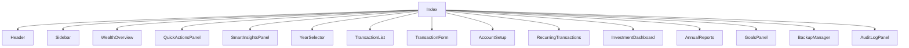

# Přehled komponent FIGR

## Shrnutí
Tento dokument mapuje hlavní komponenty aplikace, jejich účel, umístění v projektu a vztahy mezi nimi.

## Pro koho je dokument určen
- Pro vývojáře orientující se v projektu.
- Pro reviewera, který chce rychle pochopit strukturu UI.

---

## 1. Root a layout komponenty

### `App`
- Soubor: `/src/App.tsx`
- Co dělá:
  - registruje React Query provider
  - registruje tooltipy a notifikace
  - vytváří router
- Jak souvisí:
  - renderuje `Index` jako hlavní stránku aplikace

### `Index`
- Soubor: `/src/pages/Index.tsx`
- Co dělá:
  - skládá celý dashboard
  - napojuje `useFinanceData`
  - otevírá všechny hlavní moduly
- Jak souvisí:
  - centrální kompoziční bod aplikace

### `Header`
- Soubor: `/src/components/Header.tsx`
- Co dělá:
  - akční horní lišta
  - import/export, účty, styly, nová transakce
- Jak souvisí:
  - otevírá modaly a akce definované v `Index`

### `Sidebar`
- Soubor: `/src/components/Sidebar.tsx`
- Co dělá:
  - levá navigace
- Jak souvisí:
  - naviguje mezi sekcemi dashboardu a moduly

---

## 2. Dashboard komponenty

### `WealthOverview`
- Soubor: `/src/components/WealthOverview.tsx`
- Co dělá:
  - hlavní přehled čistého majetku
  - zobrazuje měsíční změnu, likviditu, investovanou část
  - zobrazuje přehled bankovních a brokerských účtů
- Jak souvisí:
  - bere snapshoty z `useFinanceData`

### `QuickActionsPanel`
- Soubor: `/src/components/QuickActionsPanel.tsx`
- Co dělá:
  - rychlé akce dashboardu
- Jak souvisí:
  - spouští dialogy otevřené v `Index`

### `SmartInsightsPanel`
- Soubor: `/src/components/SmartInsightsPanel.tsx`
- Co dělá:
  - sekundární souvislosti a upozornění
- Jak souvisí:
  - čte transakce, snapshoty a uzávěrky

### `GettingStartedPanel`
- Soubor: `/src/components/GettingStartedPanel.tsx`
- Co dělá:
  - onboarding / prázdný stav
- Jak souvisí:
  - reaguje na to, zda už existují účty a transakce

### `YearSelector`
- Soubor: `/src/components/YearSelector.tsx`
- Co dělá:
  - roční pohled na finance
- Jak souvisí:
  - filtruje data nad seznamem transakcí a reportním kontextem

---

## 3. Finance komponenty

### `TransactionForm`
- Soubor: `/src/components/TransactionForm.tsx`
- Co dělá:
  - přidání a editace transakcí
- Jak souvisí:
  - zapisuje do `useFinanceData`

### `TransactionList`
- Soubor: `/src/components/TransactionList.tsx`
- Co dělá:
  - výpis transakcí po měsících
  - snapshoty účtů
  - uzávěrka měsíce
- Jak souvisí:
  - čte transakce a snapshoty z `useFinanceData`

### `AccountSetup`
- Soubor: `/src/components/AccountSetup.tsx`
- Co dělá:
  - správa bankovních a brokerských účtů
- Jak souvisí:
  - aktualizuje datovou vrstvu financí

### `RecurringTransactions`
- Soubor: `/src/components/RecurringTransactions.tsx`
- Co dělá:
  - správa trvalých příkazů
- Jak souvisí:
  - využívá `useFinanceData` pro zápis i hromadné vyplnění měsíce

### `GoalsPanel`
- Soubor: `/src/components/GoalsPanel.tsx`
- Co dělá:
  - správa finančních cílů
- Jak souvisí:
  - pracuje s cíli a transakcemi v `useFinanceData`

### `AuditLogPanel`
- Soubor: `/src/components/AuditLogPanel.tsx`
- Co dělá:
  - zobrazuje auditní záznamy
- Jak souvisí:
  - čte auditní log z `useFinanceData`

### `BackupManager`
- Soubor: `/src/components/BackupManager.tsx`
- Co dělá:
  - správa záloh
- Jak souvisí:
  - používá Electron backup API

### `BackupReminder`
- Soubor: `/src/components/BackupReminder.tsx`
- Co dělá:
  - připomínka práce se zálohami
- Jak souvisí:
  - otevírá `BackupManager`

### `CSVImport`
- Soubor: `/src/components/CSVImport.tsx`
- Co dělá:
  - import/export finanční šablony
- Jak souvisí:
  - používá `/src/utils/importTemplate.ts`

### `Charts`
- Soubor: `/src/components/Charts.tsx`
- Co dělá:
  - doplňkové finanční grafy
- Jak souvisí:
  - čte transakce z finance hooku

---

## 4. Investiční komponenty

### `InvestmentDashboard`
- Soubor: `/src/components/investments/InvestmentDashboard.tsx`
- Co dělá:
  - hlavní vstup do investičního modulu
- Jak souvisí:
  - napojuje `useInvestmentData`

### `PortfolioOverview`
- Soubor: `/src/components/investments/PortfolioOverview.tsx`
- Co dělá:
  - hlavní KPI portfolia
  - vývoj portfolia v čase
- Jak souvisí:
  - využívá `PortfolioSummary`

### `AssetTable`
- Soubor: `/src/components/investments/AssetTable.tsx`
- Co dělá:
  - rozdělení portfolia
  - tabulka aktiv
- Jak souvisí:
  - zobrazuje breakdown podle typu, poskytovatele, měny a sektoru

### `AssetDetail`
- Soubor: `/src/components/investments/AssetDetail.tsx`
- Co dělá:
  - detail jednoho aktiva
  - ceny, historie, transakce
- Jak souvisí:
  - pracuje s vybraným aktivem z `AssetTable`

### `AddTransactionForm`
- Soubor: `/src/components/investments/AddTransactionForm.tsx`
- Co dělá:
  - ruční zápis investiční transakce
  - založení nového aktiva
- Jak souvisí:
  - zapisuje do `useInvestmentData`

### `InvestmentCSVImport`
- Soubor: `/src/components/investments/InvestmentCSVImport.tsx`
- Co dělá:
  - import investičních dat
- Jak souvisí:
  - používá `/src/utils/investmentImportTemplate.ts`

### `ImportHistory`
- Soubor: `/src/components/investments/ImportHistory.tsx`
- Co dělá:
  - přehled import batchů
- Jak souvisí:
  - umožňuje vrátit import zpět

### `PriceManagement`
- Soubor: `/src/components/investments/PriceManagement.tsx`
- Co dělá:
  - správa cen aktiv

### `ExchangeRateManagement`
- Soubor: `/src/components/investments/ExchangeRateManagement.tsx`
- Co dělá:
  - správa kurzů

### `DividendOverview`
- Soubor: `/src/components/investments/DividendOverview.tsx`
- Co dělá:
  - přehled dividend
- Jak souvisí:
  - čerpá `dividendDetails` a `dividendCalendar` z `PortfolioSummary`

### `BrokerConnectionsPanel`
- Soubor: `/src/components/investments/BrokerConnectionsPanel.tsx`
- Co dělá:
  - přehled připravených konektorů brokerů

### `SettingsPanel`
- Soubor: `/src/components/investments/SettingsPanel.tsx`
- Co dělá:
  - nastavení reportovací měny portfolia

---

## 5. Reportní komponenty

### `AnnualReports`
- Soubor: `/src/components/reports/AnnualReports.tsx`
- Co dělá:
  - roční finanční souhrny
  - vývoj majetku po měsících
  - vývoj majetku ze snapshotů
- Jak souvisí:
  - kombinuje data z transakcí a snapshotů

---

## 6. Sdílené podpůrné komponenty

### `InstitutionAvatar`
- Soubor: `/src/components/InstitutionAvatar.tsx`
- Co dělá:
  - zobrazuje vizuální identitu banky nebo brokera

### `VisualThemePanel`
- Soubor: `/src/components/VisualThemePanel.tsx`
- Co dělá:
  - výběr barevného stylu aplikace

### `NavLink`
- Soubor: `/src/components/NavLink.tsx`
- Co dělá:
  - pomocný navigační prvek v sidebaru

---

## 7. Vztahy mezi komponentami

---

## TODO
- Doplnit i seznam všech `ui/*` primitiv.

## Možná rozšíření
- Přidat mapu props a callbacků mezi hlavními komponentami.
