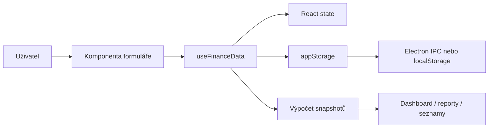
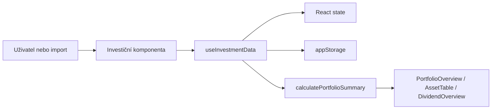
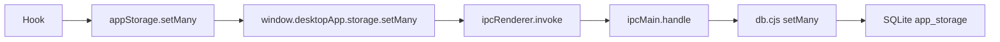
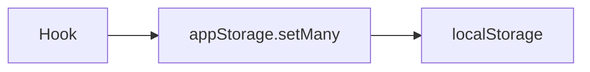
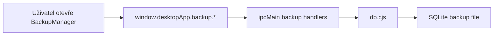

# Tok dat aplikací FIGR

## Shrnutí
Tento dokument popisuje, jak data procházejí aplikací od uživatelského vstupu přes UI a business logiku až do lokální perzistence. Dokument pokrývá finance, investice i desktop storage vrstvu.

## Pro koho je dokument určen
- Pro vývojáře a analytiky.
- Pro správce, kteří potřebují pochopit aktualizace dat a dopočty.

---

## 1. Obecný tok dat

### Finance

### Investice

---

## 2. Tok dat ve finanční části

### 2.1 Zadání transakce
Vstupní komponenta:
- `/src/components/TransactionForm.tsx`

Průchod:
1. Uživatel vyplní formulář.
2. `Index` předá submit callback.
3. Callback zavolá `addTransaction` nebo `updateTransaction` v `/src/hooks/useFinanceData.ts`.
4. Hook upraví transakce v paměti.
5. Hook upraví zůstatky účtů.
6. Hook vytvoří auditní záznam.
7. `useEffect` v hooku uloží změny do `appStorage`.
8. Snapshoty se znovu přepočítají.
9. Dashboard a reporty se automaticky překreslí.

### 2.2 Výpočet měsíčních snapshotů účtů
Provádí:
- `/src/hooks/useFinanceData.ts`

Použitá data:
- bankovní účty
- brokerské účty
- transakce
- ručně importované měsíční zůstatky

Výstup:
- `accountSnapshots`
- `wealthSnapshots`

Snapshot účtu uchovává hrubý zůstatek i vlastní zůstatek po odečtení nastavených cizích prostředků. Měsíční kontrola pracuje s hrubým bankovním stavem, zatímco majetkové součty a reporty používají vlastní část.

Tyto snapshoty používají:
- `/src/components/WealthOverview.tsx`
- `/src/components/TransactionList.tsx`
- `/src/components/reports/AnnualReports.tsx`

### 2.3 Trvalé příkazy
Komponenta:
- `/src/components/RecurringTransactions.tsx`

Hook:
- `/src/hooks/useFinanceData.ts` -> `fillRecurringTransactions`

Tok:
1. Uživatel spustí vyplnění měsíce.
2. Aktivní trvalé příkazy se převedou na transakce.
3. Duplicity se neimportují.
4. Zůstatky účtů se přepočítají.
5. Změna se propíše do snapshotů.

### 2.4 Finanční cíle
Komponenta:
- `/src/components/GoalsPanel.tsx`

Data:
- cíle v `goals`
- transakce s `goalId`

Transformace:
- `/src/hooks/useFinanceData.ts` -> `decorateGoals`

Výsledek:
- cíl dostane dopočtený `currentAmount`
- cíl dostane stav `active` nebo `completed`

---

## 3. Tok dat v investiční části

### 3.1 Ruční zadání investice
Komponenta:
- `/src/components/investments/AddTransactionForm.tsx`

Tok:
1. Uživatel vybere nebo založí aktivum.
2. Formulář pošle data do `useInvestmentData`.
3. Hook vytvoří aktivum nebo transakci.
4. Změny se uloží do `appStorage`.
5. `calculatePortfolioSummary` přepočítá portfolio.
6. Výsledek se zobrazí v přehledech investic.

### 3.2 Import investic
Komponenty a utility:
- `/src/components/investments/InvestmentCSVImport.tsx`
- `/src/utils/investmentImportTemplate.ts`
- `/src/hooks/useInvestmentData.ts`

Tok:
1. Uživatel nahraje CSV/XLSX.
2. Import parser namapuje české i brokerové hlavičky, převede textová i excelová data a vytvoří normalizované řádky.
3. Validní řádky se pošlou do `importTransactions`.
4. Hook založí chybějící aktiva.
5. Vytvoří import batch.
6. Uloží transakce.
7. Přepočítá portfolio.

### 3.3 Výpočet portfolia
Výpočet:
- `/src/utils/investmentPortfolio.ts`

Vstupy:
- aktiva
- transakce
- ceny
- kurzy
- reportovací měna

Transformace:
- výpočet investované částky
- výpočet aktuální hodnoty
- fallback na poslední transakční cenu, pokud není živá cena
- fallback na součet pozic, pokud snapshotový zdroj ještě nemá snapshot
- nahrazení nepřiřazených pozic ručním souhrnným snapshotem Alocana, aby nedošlo k dvojímu započtení
- výpočet zisku / ztráty
- rozpad podle typu aktiva
- rozpad podle poskytovatele
- rozpad podle měny
- rozpad podle sektoru
- dividendový kalendář

Výstup:
- `PortfolioSummary`

Použití:
- `/src/components/investments/PortfolioOverview.tsx`
- `/src/components/investments/AssetTable.tsx`
- `/src/components/investments/DividendOverview.tsx`

---

## 4. Tok dat do perzistence

### appStorage
Soubor:
- `/src/lib/appStorage.ts`

Logika:
- desktop -> Electron IPC
- browser fallback -> localStorage

### Desktop cesta

### Browser fallback

---

## 5. Aktualizace dashboardu

### Po změně transakce
Změní se:
- `transactions`
- zůstatky účtů
- `accountSnapshots`
- `wealthSnapshots`

To následně aktualizuje:
- dashboard
- seznam transakcí
- roční reporty

### Po změně investic
Změní se:
- `assets`
- `transactions`
- `prices`
- `exchangeRates`

To následně aktualizuje:
- portfolio overview
- asset table
- detail aktiva
- dividendy

---

## 6. Kde se provádí transformace dat

| Transformace | Soubor |
|---|---|
| Seskupení transakcí po měsících | `/src/utils/calculations.ts` |
| Výpočet snapshotů účtů | `/src/hooks/useFinanceData.ts` |
| Přepočet čistého majetku | `/src/hooks/useFinanceData.ts` |
| Výpočet investičního portfolia | `/src/utils/investmentPortfolio.ts` |
| Parse finančního importu | `/src/utils/importTemplate.ts` |
| Parse investičního importu | `/src/utils/investmentImportTemplate.ts` |

---

## 7. Tok dat při záloze

Operace:
- výpis záloh
- vytvoření zálohy
- obnova zálohy
- otevření složky

---

## TODO
- Doplnit tok dat pro budoucí online sync brokerů.

## Možná rozšíření
- Přidat sekvenční diagramy pro finance i investice.
- Přidat explicitní mapu state ownership po komponentách.
